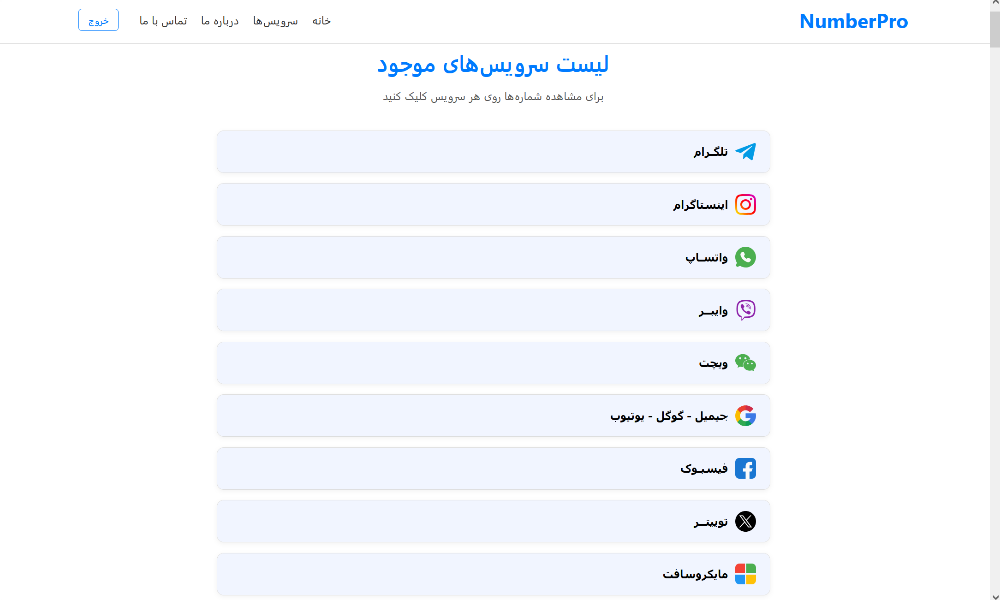

# ☎️ NumberPro – Virtual Number Management Panel


<p align="center">
  
</p>

**NumberPro** is a modern and responsive **virtual number management panel** built with **Django 5** and integrated with the **NumberLand API**.  
This project is designed for **resellers** who manually sell and manage virtual numbers — with the flexibility to upgrade to a **fully automated system** in the future.

---

## 🚀 Key Highlights

- Seamless integration with **NumberLand API**  
- Modern, clean, and **responsive** front-end  
- Built-in **Django authentication system** (admin login)  
- Secure API key management via `.env`  
- Easily extendable architecture for automation and payment gateway integration  
- Fast, scalable, and production-ready  

---

## 🧠 Technologies

* **Backend:** Python, Django 5  
* **Frontend:** HTML5, CSS3, JavaScript  
* **Database:** MySQL  
* **API Integration:** NumberLand API  
* **Environment Variables:** Managed via `.env`  

---

## ⚙️ Features

### 👤 User & Authentication
* Admin login using Django’s default authentication  
* Secure session handling and logout functionality  
* Redirection and user-based navigation control  

### ☎️ Virtual Number Management
* Fetch and display all available services via **NumberLand API**  
* Request new virtual numbers for any service  
* Organized interface for managing and viewing purchased numbers  
* Designed for **reseller workflow**, not end-user automation (for now)  

### 💻 Frontend
* Clean, modern, and fully responsive design  
* Persian RTL-compatible UI  
* Ready for future enhancements and client dashboards  

---

## 🧩 Installation & Setup

### 1️⃣ Clone the project

```bash
git clone https://github.com/YOUR_USERNAME/NumberPro.git
cd NumberPro/VisualNumber
```

### 2️⃣ Create and activate a virtual environment

```bash
python -m venv venv

# Windows
venv\Scripts\activate

# Linux / macOS
source venv/bin/activate
```

### 3️⃣ Install dependencies

```bash
pip install -r requirements.txt
```

### 4️⃣ Configure environment variables

Copy `.env.example` → `.env` and edit the following:

```
SECRET_KEY=your_secret_key
DEBUG=True
DB_NAME=number_pro
DB_USER=root
DB_PASSWORD=your_password
DB_HOST=localhost
DB_PORT=3306
API_KEY=your_numberland_api_key
```

### 5️⃣ Apply migrations

```bash
python manage.py makemigrations
python manage.py migrate
```

### 6️⃣ Create a superuser

```bash
python manage.py createsuperuser
```

### 7️⃣ Run the development server

```bash
python manage.py runserver
```

> Access the panel at: [http://127.0.0.1:8000/](http://127.0.0.1:8000/)

---

## 📁 Project Structure

```
NumberPro/
│
├── VisualNumber/
│   ├── apps/
│   ├── media/
│   ├── static/
│   ├── templates/
│   ├── VisualNumber/      # Core project directory
│   ├── manage.py
│   ├── .env
│   ├── .env.example
│
├── requirements.txt
├── README.md
└── .gitignore
```

---

## 🧱 Example `.env` File

```env
SECRET_KEY=django-insecure-example-key
DEBUG=True
DB_NAME=number_pro
DB_USER=root
DB_PASSWORD=password
DB_HOST=localhost
DB_PORT=3306
API_KEY=example-numberland-api-key
```

---

## 💼 About the Project

NumberPro is currently designed as a **manual reseller panel** for managing virtual numbers using the **NumberLand API**.  
The reseller logs in via Django’s admin authentication system, purchases numbers for any desired service or country, and distributes them to end users.  
This structure is built to **easily evolve into an automated sales system**, supporting payment integration and user dashboards.

---

## 📄 License

This project is licensed under the **MIT License** — see the [LICENSE](LICENSE) file for details.

---

## 👨‍💻 Developer

Hi, I'm **Mohammad Salkhorde** 👋  
**Python / Django Backend Developer** — building APIs and scalable web platforms.

* 🌐 **Portfolio:** [https://mohammad-salkhorde.ir](https://mohammad-salkhorde.ir)  
* 🐙 **GitHub:** [https://github.com/MohammadSalkhorde](https://github.com/MohammadSalkhorde)  
* 💼 **LinkedIn:** [https://www.linkedin.com/in/mohammad-salkhorde-a13767385](https://www.linkedin.com/in/mohammad-salkhorde-a13767385)  
* ✉️ **Email:** [m.salkhorde444@gmail.com](mailto:m.salkhorde444@gmail.com)
